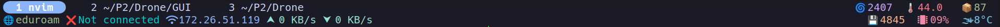

# Dotfiles

## nvim

### Plugins
#### git-signs
**The colors next to line numbers are:**

- , *yellow* - Changed line

- , *green* - Added line

- , *red* - Deleted line(under the red line)
---

## zshrc

## tmux

### Status bar

#### Functions
**Top Line**
  | Tab bar | *---blank space---* | Fan speed | CPU Temperature | Updates for packages |
  |---------|---------------------|----------:|:---------------:|:--------------------:|

**Bottom Line**
  | wlan0 SSID | NordVPN Status | Local IP | Upload Speed | Download Speed | *---blank space---* | Memory Usage | CPU Usage | Current Weather |
  |------------|----------------|----------|--------------|----------------|---------------------|--------------|-----------|-----------------|

#### Scripts
- **.tmux_update_network_info.sh**
    - Updates ssid, Nordvpn status & local ip
    - Sleeps for 3 minutes
- **.tmux_network_speed.sh**
    - Updates upload & download speed
    - Sleeps for 1 second
- **.tmux_update_resources**
    - Updates cpu usage/temp, memory usage & fan speed
    - Sleeps for 5 seconds
- **.tmux_update_system_info**
    - Updates packages not yet downloaded and the weather status
    - Sleeps for 3 hours

